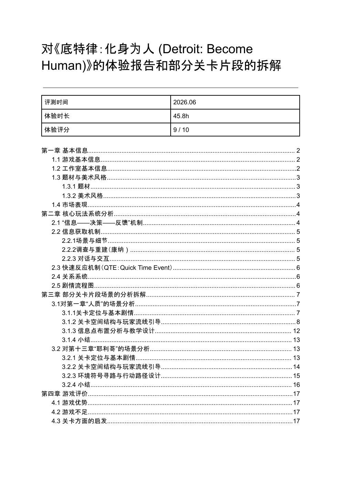

# 《底特律：变人》体验与关卡拆解

一份围绕《底特律：变人》（Detroit: Become Human）的游戏体验报告与关卡设计拆解，重点分析互动叙事游戏如何通过信息获取、玩家决策与结果反馈建立参与感，并结合具体章节讨论空间引导、信息布置与教学设计。

## 文档信息

- 制作时间：2026年6月
- 体验时长：45.8小时
- 文档页数：17页
- 内容类型：游戏体验报告 / 系统分析 / 关卡拆解

## 主要内容

- 游戏题材、美术风格与市场表现概览
- “信息 - 决策 - 反馈”核心机制分析
- 场景探索、调查重建、对话交互、QTE与关系系统
- 第一章「人质」的空间结构、玩家流线、信息点布置与教学设计
- 第十三章「耶利哥」的环境符号寻路与行动路径设计
- 游戏优势、不足及关卡设计启发

## 完整文档

[查看 / 下载高清 PDF](docs/detroit-become-human-analysis.pdf)

## 说明

本项目为个人学习、研究与作品集展示用途，与 Quantic Dream、Sony Interactive Entertainment 无关联。游戏名称、画面及相关知识产权归其原权利方所有。
